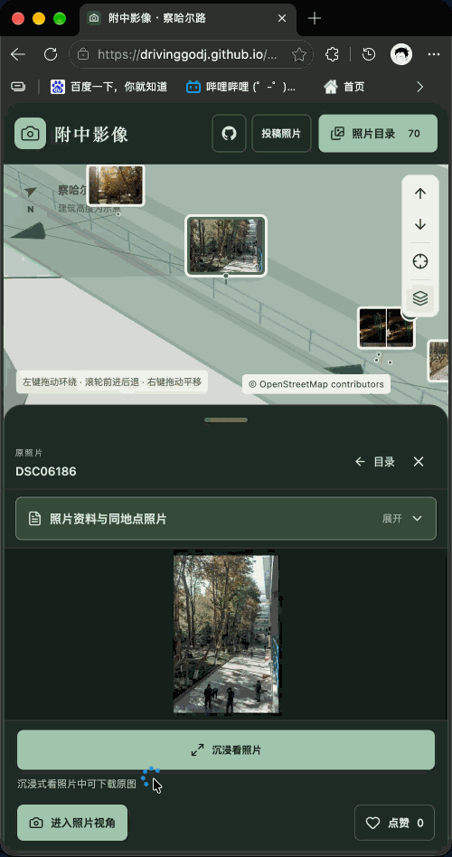
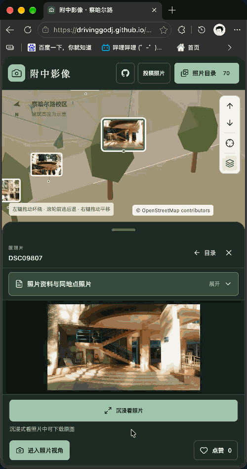

# 附中影像

**照片留住片刻，地图记住位置。**

南师附中察哈尔路校区 · 可以漫游的校园照片档案

[走进校园](https://drivinggodj.github.io/nsfz-campus-gallery/) · [投稿照片](https://drivinggodj.github.io/nsfz-campus-gallery/submit.html)

从校门望向宿舍的天文台，沿未名湖走过湖心亭，再回到熟悉的教室与走廊。这里把校园照片放回它们的拍摄位置：既可以翻看照片，也可以在三维地图里找一找，那个瞬间发生在哪里。

无需注册，打开网页即可浏览。电脑、平板和手机都可以使用。

## 从地图走进照片

选中一张照片，点击 **沉浸看照片**：界面渐渐收起，镜头回到拍摄位置，照片沿着画面中的远近层次逐步显现。退出时，校园模型重新浮现，再回到照片与地图的对照画面。

<table>
<tr>
<td width="50%" align="center">

  
<strong>校园树影 · 竖幅照片</strong>
 
从模型走进树影，再回到校园地图。
</td>
<td width="50%" align="center">

  
<strong>楼梯光影 · 横幅照片</strong>
 
对照楼梯间的结构，重看拍摄时的光线。
</td>
</tr>
</table>

沉浸浏览时，底部可以 **返回地图** 或 **下载原图**。横幅、竖幅照片都能完整查看，地图画布不会因界面收起而突然改变大小。

## 找到熟悉的校园

网站打开时会显示照片目录，默认按**点赞最多**排列，也可以切换为上传顺序或拍摄时间。点目录中的照片，或地图上的缩略图，就能同时看到照片和校园模型。

- **按地点找照片**：主要建筑、未名湖、操场、树林、天桥、地下通道入口，以及地上和地下的走廊都可以筛选；也可以只看航拍照片。
- **走进某一层**：选择建筑中的照片时，会定位到对应楼层，暂时隐藏上方楼层；进入照片视角后恢复完整建筑。
- **展开一组回忆**：远处的相近照片会合成缩略图，靠近后可分开展示。拍摄位置相距两米以内的照片保留在同一组，点击后在菜单中选择；目录打开时也可以直接选择。
- **找到准确的位置**：缩略图可以合并，每张照片的拍摄点仍会显示在地图上。两三张照片左右拼接，更多照片用四格拼图展示。
- **给喜欢的照片点赞**：不需要账号，可以再次点击取消。点赞记录与当前浏览器关联。

## 照片与模型，一起看

照片目录和预览以卡片覆盖在地图上，打开、关闭时地图不会忽然变窄。拖动卡片顶部的**把手**，就能调整卡片大小；选中照片后，模型会在卡片没有遮住的区域内居中。

电脑上照片与模型左右对照，手机上上下展示，横竖照片都能完整查看。点击**照片资料与同地点照片**，可以展开拍摄时间、地点、楼层、镜头参数、作者和版权资料，并继续向下滑动。

点击 **进入照片视角**，地图会平滑移动到拍摄者的位置，按照照片记录的方向看向校园。此时可以开启 **半透明照片叠加**，让原画面与模型重合，观察树木、走廊和建筑在照片里的对应关系。关闭叠加便可继续看模型；返回地图后，恢复进入前的观察视角。

选中照片时，地图会自动呈现照片对应的季节与拍摄时段，天空和光线渐变切换。取消选择后恢复目录所选的外观，季节和时段筛选不会因此改变。没有相应时间资料的照片沿用目录当前外观。

浏览只使用缩略图和次高清图两档，次高清图均小于 500 KB。进入网站后优先预加载点赞最高的 3 张；照片在视野中停留 1.2 秒后也会提前准备。选中照片后立即优先加载这一张，并停止其他未完成的预加载。所有优先加载都按 **缩略图 → 深度图 → 次高清图** 的顺序进行。进入沉浸浏览时，必须先加载并解析深度图，再用缩略图以正常速度展开画面的 10%，无需等次高清图加载完成；后续动画跟随次高清图的加载进度放缓，最快保持正常速度。深度图加载失败时提供重试，转场不会提前开始。转场结束后展示次高清图，原图仅在点击 **下载原图** 时下载。

想与朋友分享某张照片，可以直接复制当前网页地址。需要高清文件时，请在 **沉浸看照片** 中点击 **下载原图**。

## 看见四季与晨昏

目录支持按**春、夏、秋、冬**和**清晨、白天、傍晚、夜间**筛选。季节会改变树木与校园的色彩，时段会改变地图的光线与天空：清晨的暖色天际、白天的蓝天薄云、傍晚的夕阳，以及夜间的月亮星空。切换天空时会渐变过渡，照片始终保留自己的颜色。

季节根据拍摄月份分类，时段根据照片记录的拍摄时刻分类。时间资料缺失的照片可在“时间待补充”中找到。未选择时段时，网站跟随系统的深色或浅色外观。

| 时段 | 拍摄时刻 |
| --- | --- |
| 清晨 | 05:00–08:00 |
| 白天 | 08:00–17:00 |
| 傍晚 | 17:00–19:00 |
| 夜间 | 19:00–次日 05:00 |

## 怎么逛

| 操作 | 键鼠 | 触屏 |
| --- | --- | --- |
| 环绕观察 | 左键拖动 | 单指拖动 |
| 前进、后退 | 滚轮，或地图的箭头按钮 | 双指开合，或箭头按钮 |
| 平移 | 右键拖动 | 双指同向移动 |
| 回到起点 | 点击“校园全景”按钮 | 点击“校园全景”按钮 |

点击照片、建筑或地点，模型会在卡片未遮挡的区域内居中；再次点击同一项，或点击地图空白处，可以取消选择。地图中的“地下空间”按钮可以查看地下通道、走廊与运动空间。

## 留下你的校园照片

欢迎同学、老师和校友补充校园的不同季节、角落和年代。

1. 打开[投稿照片](https://drivinggodj.github.io/nsfz-campus-gallery/submit.html)，一次选择多张照片，也可以继续添加。
2. 在“待投稿照片”中逐张标记拍摄位置，填写标题、楼层和镜头方向。用 **照片视角** 对照原片，直接拖动调整角度，也可以开启 **半透明照片叠加** 校准位置与朝向。航拍照片有定位与高度元数据时，会自动读取；普通照片只需记录楼层。
3. 阅读并确认投稿准则，点击“生成投稿照片包”，将全部照片下载为一个 ZIP。
4. 点击“用一封邮件投稿”，**手动把这个 ZIP 添加为附件**，发送到 **[drivinggodj@icloud.com](mailto:drivinggodj@icloud.com)**。不需要逐张发邮件。

照片包包含每张原片及独立标注，审核后才会出现在网站。每包最多 20 张、原片合计 100 MB，单张最多 40 MB。网页生成照片包并不代表邮件已经发送。支持文件分享的设备，也可以把照片包直接分享到邮件应用；超过邮箱附件限制时，可使用邮箱的超大附件功能。

如果已经准备好与照片对应的 **深度图**，可以在投稿时一并附上，用于沉浸浏览的转场；没有深度图也可以正常投稿和浏览。

请提交自己拍摄或已获授权的照片。作者和版权信息会从原片已有元数据中读取；没有记录时留空，也可以在投稿时补充或修正。

优先投稿校园景观、建筑、公共空间及四季校园环境。尽量避免以人物、物品或动物为主体的照片。**禁止上传同学的大头照、面部特写，以及侵犯隐私权、肖像权或其他权益的照片**，请勿泄露个人信息。所有投稿均需审核，符合准则后才会公开展示。

## 关于这份档案

这是围绕校园影像制作的个人项目。三维地图以 OpenStreetMap 轮廓为基础，并参考校园照片与校友标注修正；建筑高度与部分细节为示意，用来帮助理解拍摄位置。

地图数据 © [OpenStreetMap contributors](https://www.openstreetmap.org/copyright)，遵循 ODbL。照片版权属于各自权利人，下载功能不代表获得转载许可；使用前请查看照片的作者与版权说明。

发现位置、楼层或模型有误，可以在 [Issues](https://github.com/DrivingGodJ/nsfz-campus-gallery/issues) 留下反馈。

开发与维护

本地编辑、照片包审核、图片生成与 GitHub Pages 部署说明见[维护文档](docs/MAINTENANCE.md)。

