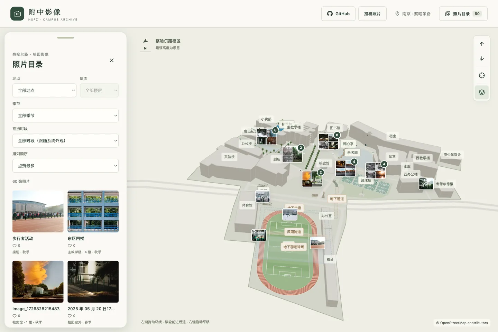
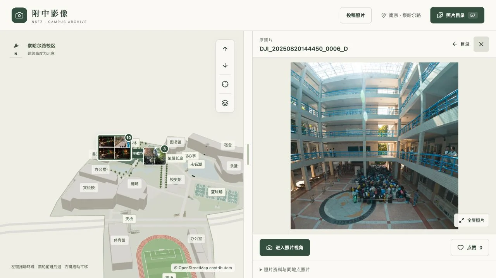
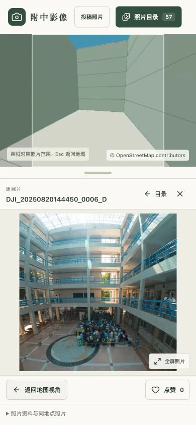
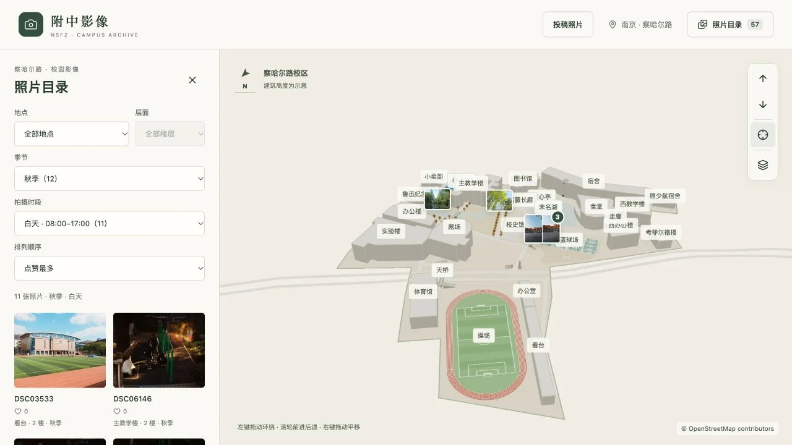

# 附中影像

**照片留住片刻，地图记住位置。**

南师附中察哈尔路校区 · 可以漫游的校园照片档案

[走进校园](https://drivinggodj.github.io/nsfz-campus-gallery/) · [投稿照片](https://drivinggodj.github.io/nsfz-campus-gallery/submit.html)

从校门望向宿舍的天文台，沿未名湖走过湖心亭，再回到熟悉的教室与走廊。这里把校园照片放回它们的拍摄位置：既可以翻看照片，也可以在三维地图里找一找，那个瞬间发生在哪里。

无需注册，打开网页即可浏览。电脑、平板和手机都可以使用。

## 找到熟悉的校园

网站打开时会显示照片目录，默认按**点赞最多**排列，也可以切换为上传顺序或拍摄时间。点目录中的照片，或地图上的缩略图，就能同时看到照片和校园模型。

- **按地点找照片**：主要建筑、未名湖、操场、树林，以及地上和地下的走廊都可以筛选。
- **走进某一层**：选择建筑中的照片时，会定位到对应楼层，暂时隐藏上方楼层；进入照片视角后恢复完整建筑。
- **展开一组回忆**：相近照片会合成缩略图。靠近后可分开展示，同一拍摄点的照片则在菜单中选择。
- **给喜欢的照片点赞**：不需要账号，可以再次点击取消。点赞记录与当前浏览器关联。

## 照片与模型，一起看

照片和地图可以同时展示，拖动中间分隔条，就能调整两边的大小。手机上会自动改为上下排列，横竖照片都能完整查看。

点击**进入照片视角**，地图会平滑移动到拍摄者的位置，按照照片记录的方向看向校园。返回地图后，恢复进入前的观察视角。

普通查看先显示轻量缩略图，再载入清晰预览；只有全屏查看或下载时才加载高清 JPEG。等待高清图时，已显示的照片会留在画面里。

<table>
<tr>
<td width="36%" align="center">

</td>
<td>
<strong>在手机上，也能对照拍摄视角</strong>
  
上方查看模型，下方查看照片。拖动分隔条分配空间，点击“全屏照片”查看细节，或打开“照片资料与同地点照片”了解拍摄时间、楼层、镜头参数及署名。
  
分享某张照片时，可以直接复制当前网页地址。
</td>
</tr>
</table>

## 看见四季与晨昏

目录支持按**春、夏、秋、冬**和**清晨、白天、傍晚、夜间**筛选。季节会改变树木与校园的色彩，时段会改变地图的光线；照片始终保留自己的颜色。

季节根据拍摄月份分类，时段根据照片记录的拍摄时刻分类。时间资料缺失的照片可在“时间待补充”中找到。未选择时段时，网站跟随系统的深色或浅色外观。

## 怎么逛

| 操作 | 键鼠 | 触屏 |
| --- | --- | --- |
| 环绕观察 | 左键拖动 | 单指拖动 |
| 前进、后退 | 滚轮，或地图的箭头按钮 | 双指开合，或箭头按钮 |
| 平移 | 右键拖动 | 双指同向移动 |
| 回到起点 | 点击“校园全景”按钮 | 点击“校园全景”按钮 |

点击建筑或地点会自动移到画面中心，点击空白处可以取消选择。地图中的“地下空间”按钮可以查看地下通道、走廊与运动空间。

## 留下你的校园照片

欢迎同学、老师和校友补充校园的不同季节、角落和年代。

1. 打开[投稿照片](https://drivinggodj.github.io/nsfz-campus-gallery/submit.html)，选择一张照片。
2. 标记拍摄位置，填写标题、楼层和镜头方向；也可以体验照片视角，拖动调整角度。航拍照片有定位与高度元数据时，会自动读取。
3. 点击“生成投稿照片包”，下载 ZIP。
4. 点击“打开邮件投稿”，**手动把 ZIP 添加为附件**，发送到 **[drivinggodj@icloud.com](mailto:drivinggodj@icloud.com)**。

照片包包含原片和标注，审核后才会出现在网站。网页生成照片包并不代表邮件已经发送。支持文件分享的设备，也可以把照片包直接分享到邮件应用。

请提交自己拍摄或已获授权的照片。作者和版权信息会从原片已有元数据中读取；没有记录时留空，也可以在投稿时补充或修正。

## 关于这份档案

这是围绕校园影像制作的个人项目。三维地图以 OpenStreetMap 轮廓为基础，并参考校园照片与校友标注修正；建筑高度与部分细节为示意，用来帮助理解拍摄位置。

地图数据 © [OpenStreetMap contributors](https://www.openstreetmap.org/copyright)，遵循 ODbL。照片版权属于各自权利人，下载功能不代表获得转载许可；使用前请查看照片的作者与版权说明。

发现位置、楼层或模型有误，可以在 [Issues](https://github.com/DrivingGodJ/nsfz-campus-gallery/issues) 留下反馈。

开发与维护

本地编辑、照片包审核、图片生成与 GitHub Pages 部署说明见[维护文档](docs/MAINTENANCE.md)。

